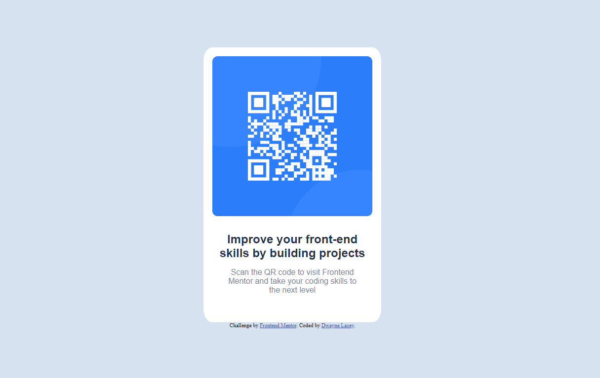

# Frontend Mentor - QR code component solution

This is a solution to the [QR code component challenge on Frontend Mentor](https://www.frontendmentor.io/challenges/qr-code-component-iux_sIO_H). Frontend Mentor challenges help you improve your coding skills by building realistic projects. 

## Table of contents

- [Overview](#overview)
  - [Screenshot](#screenshot)
  - [Links](#links)
- [My process](#my-process)
  - [Built with](#built-with)
  - [What I learned](#what-i-learned)
  - [Continued development](#continued-development)
  - [Useful resources](#useful-resources)
- [Author](#author)


## Overview

### Screenshot



### Links

- Solution URL: [https://github.com/Dwayne-Lacey/QR-Code](https://github.com/Dwayne-Lacey/QR-Code)
- Live Site URL: [https://dwayne-lacey.github.io/QR-Code/](https://dwayne-lacey.github.io/QR-Code/)

## My process

### Built with

- Semantic HTML5 markup
- CSS custom properties
- Flexbox


### What I learned

One of the major things I struggled with on this project was the use of the box model to properly organize my elements on screen.

```css
.main-container {
    margin-left: auto;
    margin-right: auto;
    margin-top: 100px;
    border-radius: 5%;
    padding-bottom: 2.5em;
    width: 100%;
    max-width: 360px;
    background-color: hsl(0, 0%, 100%);
    display: flex;
    flex-direction: column;
}
```
While I previously had tried to manually set my margins, it felt like no matter what I'd made my margins there was no change. Eventually I learned that I needed to keep my left and right margins set to auto. 

I also couldn't seem to get the included font family from google to display, so I was forced to use the fallback font. I linked my font within my html like so:

```html
  <link rel="stylesheet" href="styles.css">
  <link rel="stylesheet" href="https://fonts.google.com/specimen/Outfit">
```

Then I also set the font family to Outfit in my css as shown:

```css
h1 {
    font-family: 'Outfit', sans-serif;
    text-align: center;
    color: hsl(218, 44%, 22%);
    font-weight: 700;
    font-size: x-large;
    padding-left: 30px;
    padding-right: 30px;
    margin-top: 15px;
    margin-bottom: 0px;
}

p {
    font-family: 'Outfit', sans-serif;
    text-align: center;
    color: hsl(220, 15%, 55%);
    font-weight: 400;
    padding-top: 0px;
    padding-left: 40px;
    padding-right: 40px;

}
```

### Continued development

In the future I would like to get better at planning out in advance how I'll organize my elements and I'd like to better understand how to get the most out of using flexbox. I also think that I still could use some more work on understanding how to effectively using the box model.

### Useful resources

- [W3Schools](https://www.w3schools.com/css/css_align.asp) - I've used W3Schools before, but their resources on their site helped me tremendously in understanding the necessary syntax in CSS
- [MDN Web Docs](https://developer.mozilla.org/en-US/docs/Learn/CSS/CSS_layout/Flexbox) - Mozilla's developer documentation has also been a tremendous help in helping me understand how to use flexbox and I believe I'll be coming back to this resource a lot more in the future.


## Author

- Frontend Mentor - [@Dwayne-Lacey](https://www.frontendmentor.io/profile/Dwayne-Lacey)
- Dev.To - [@dlacey](https://dev.to/dlacey)

